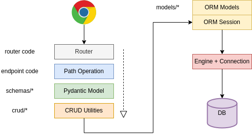

# EV Forklift Fastapi
clone project
```
git clone git@github.com:cuongtv-smartosc/template-fastapi.git
cd template-fastapi
```

## Overall Diagram


## To do list
- [x] Validate request using pydantic(built-in) (phongtt)
- [x] Authentication using built-in jwt (linh)
- [ ] Custom response model using built-in pydantic (tranhnv)
- [x] Handle error exception (daocm)
- [ ] Setup config get from os env (namvh)
- [x] Testing and coverage using sqlalchemy (cuongtv)
- [ ] Logging request params and db query (namvh)
- [x] Custom built-in swagger with more information (dungnv)
- [x] CORS setup (daocm)
- [x] Install Pre-commit to setup convention (cuongtv)
- [x] CORS setup (daocm)
- [ ] Upload testcase to jira
- [ ] Authorization base on Role

# Requirements
1. `>= Python 3.10`

## Install environment
```
python3 -m venv venv
source venv/bin/activate
pip install -r requirements.txt
```

## Install pre-commit
```
pre-commit install
pre-commit installed at .git/hooks/pre-commit
```

## [Option] Run docker-compose
```
docker-compose up -d
```
## Run file import_data.py
file import_data.py để create database and import data
argument -dir: đường dẫn file import
         -host: host connect database
         -user: user file argument
         -pass: pass file argument
ex: /Users/tranvancuong/Download/all.sql
```
cd template-fastapi/
python3.10 import_data.py -dir /Users/tranvancuong/Download/all.sql -host localhost -user root -pass 123456
```
## Run dev server
```
uvicorn main:app --reload
```

online doc address
```
http://127.0.0.1:8010/docs
or
http://127.0.0.1:8010/redoc
```

## Run test
Create new database for test and update in config.yml file
```
DB_DATABASE="db_test"
```
Run test
```
pytest
```
